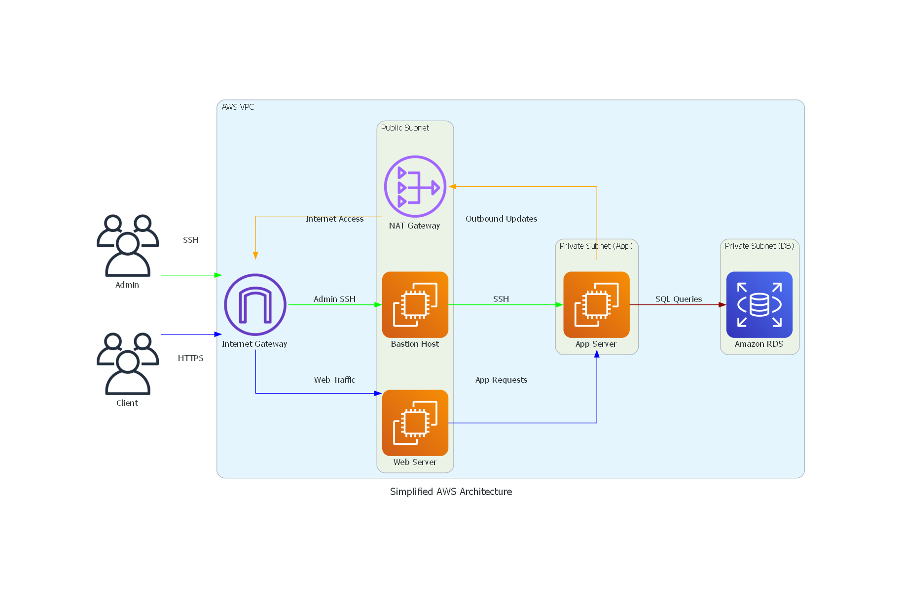

# AWS 3-Tier Architecture Lab – Project Documentation

This repository contains my first AWS infrastructure project: a secure 3-tier environment built from scratch on AWS. It documents what I built, why I made certain design decisions, and how I validated the architecture end to end. My goal was not just to complete a lab, but to understand the reasoning behind each component and present the work with a security-first mindset.

## Project Summary

The goal of this lab was to design and deploy a **3-tier architecture** on AWS. The environment consists of:

- A **custom VPC** with clearly defined public and private subnets
- Separate **security groups** for the bastion host, web server, application server, and database
- A **bastion host** in the public subnet for controlled administrative access
- A **web server** exposed to the internet through the public subnet
- An **application server** hosted privately with no public IP
- A private **RDS MariaDB** instance inside dedicated database subnets

Throughout the build, I focused on **network segmentation**, **least privilege**, and **defence in depth** so that each tier is isolated and only receives the minimum traffic it requires.

## Architecture Diagram

The high-level design is illustrated below. It shows the VPC, public and private tiers, gateways, compute instances, and the database layer. The traffic flow reflects a security-conscious design in which public access is limited to intended entry points while internal communication stays controlled.

## Build Steps & Rationale

### 1. Networking Setup

1. **Create a VPC**  
   I used the CIDR block `192.168.0.0/16` to provide enough address space for multiple subnets. A custom VPC gives full control over addressing, routing, and segmentation.

2. **Create subnets**  
   Four subnets were created:
   - **Public subnet:** `192.168.1.0/24` for the bastion and web server
   - **Private subnet 1:** `192.168.2.0/24` for the application server
   - **Private subnet 2:** `192.168.3.0/24` for the database tier
   - **Private subnet 3:** `192.168.4.0/24` for the database tier

   Keeping the application and database tiers private reduces direct internet exposure and improves isolation.

3. **Allocate an Elastic IP**  
   This was required for the NAT Gateway so private instances could access the internet for updates without becoming publicly reachable.

4. **Create an Internet Gateway**  
   This enables internet connectivity for resources in the public subnet.

5. **Create a NAT Gateway**  
   The NAT Gateway was placed in the public subnet and associated with the Elastic IP. It allows private resources to initiate outbound traffic while blocking direct inbound internet traffic.

6. **Configure route tables**
   - **Public route table:** default route (`0.0.0.0/0`) to the Internet Gateway
   - **Private route table:** default route (`0.0.0.0/0`) to the NAT Gateway

   This separation ensures that private subnets do not route directly to the internet.

7. **Create security groups**
   - **Bastion SG:** allows SSH from my IP and limited public web access used in the lab
   - **Web SG:** allows public web traffic and controlled internal communication
   - **App SG:** allows SSH from the bastion host, ICMP from the web tier, and only the application/database traffic required for validation
   - **DB SG:** allows MySQL/Aurora only from the application tier and bastion host

   Using separate security groups per tier supports least privilege and reduces blast radius.

### 2. Launch Compute Instances

1. **Bastion Host**  
   An **Amazon Linux 2023** instance launched in the public subnet with a public IP and the Bastion SG attached. This acts as the controlled administrative entry point to the environment.

2. **Web Server**  
   Another **Amazon Linux 2023** instance launched in the public subnet. It was configured to serve the public-facing tier and represent the internet-accessible application entry point.

3. **Application Server**  
   An **Amazon Linux 2023** instance launched in **Private Subnet 1** with no public IP. It is reachable only through intended internal paths and communicates with the database privately.

### 3. Provision the Database

1. **DB Subnet Group**  
   I created a DB subnet group spanning the private subnets reserved for the database tier. This supports isolation and prepares the design for better resilience.

2. **RDS Instance**  
   A **MariaDB RDS instance** was deployed in private subnets with internet access disabled and the DB security group attached. For lab speed and simplicity, I used the free tier configuration.

## Validation & Connectivity Testing

I validated the architecture step by step:

1. SSH into the **Bastion Host**
2. Transfer the private key to the bastion and secure its permissions
3. SSH from the bastion into the **Application Server**
4. Ping the **Web Server** from the app tier to verify east-west communication
5. Connect from the app tier to the **RDS endpoint** using the MariaDB client
6. Run `SHOW DATABASES;` successfully

These checks confirm that each tier can communicate only across intended paths and that the database is not directly exposed to the public internet. I also validated that private resources were reachable only through controlled internal paths rather than direct external access.

## Screenshots

The following screenshots document each major stage of the project.

| Step | Filename | Description |
|------|----------|-------------|
| **VPC / Subnets** | `images/01-vpc-subnets.png` | VPC and subnet layout in the AWS console |
| **Route Tables / IGW / NAT Gateway** | `images/02-routing.png` | Routing configuration and gateway setup |
| **Security Groups** | `images/03-security-groups.png` | Final inbound rules for each security group |
| **EC2 Instances** | `images/04-ec2-instances.png` | Bastion, web, and app instances in running state |
| **DB Subnet Group / RDS** | `images/05-rds.png` | Database subnet group and RDS configuration |
| **Bastion SSH / App Server Access** | `images/06-ssh-test.png` | SSH validation from bastion to app server |
| **Database Connectivity Test** | `images/07-db-test.png` | App-to-database connectivity and `SHOW DATABASES;` output |

## Key Decisions & Trade-Offs

- **Separate security groups per tier** rather than one shared group, to enforce least privilege and reduce the impact of a compromise
- **Private subnets for the app and database tiers** to minimize attack surface
- **NAT Gateway for outbound-only internet access** from private resources
- **Bastion host for administrative access** instead of exposing SSH on private resources
- **Route table separation** to keep the public and private network paths distinct

These choices reflect AWS security best practices and a defence-in-depth approach.

## What I Learned

This project helped me understand:

- how a 3-tier architecture is structured in AWS
- how public and private networking work together inside a VPC
- how Internet Gateway and NAT Gateway serve different roles
- how security groups control both north-south and east-west traffic
- how a bastion host can act as a controlled jump point
- how private application and database tiers can be validated without public exposure

## Future Improvements & Roadmap

To build on this project, I would next:

1. **Rebuild the architecture with Terraform or CloudFormation** to demonstrate Infrastructure as Code
2. **Add monitoring and alerting** with CloudWatch and SNS
3. **Improve secret handling** using AWS Secrets Manager instead of relying on manual credential handling
4. **Add a load balancer and auto scaling** for a more production-like web tier
5. **Replace bastion-based administration with AWS Systems Manager Session Manager** in a more mature version of the design
6. **Strengthen the database setup** with encryption, automated backups, and tighter operational controls

## About Me

I am an **AWS re/Start graduate** and a final-year **Cybersecurity student** at FAST-NUCES, Karachi. I hold the **AWS Certified Cloud Practitioner** and **(ISC)² Certified in Cybersecurity (CC)** credentials. Through internships at the **State Bank of Pakistan** and **MRBF Consulting**, I have gained experience in network segmentation, risk management, and compliance. My goal is to become a cloud security engineer who builds compliant, resilient infrastructure with a security-first mindset.

You can learn more about my background on [my LinkedIn](https://www.linkedin.com/in/adeen-ali/).

---

**Note:** This project is documented as a portfolio piece to demonstrate both implementation and reasoning. The focus is not just on building the lab, but on explaining the architecture clearly and validating it in a way that reflects practical cloud security thinking.
